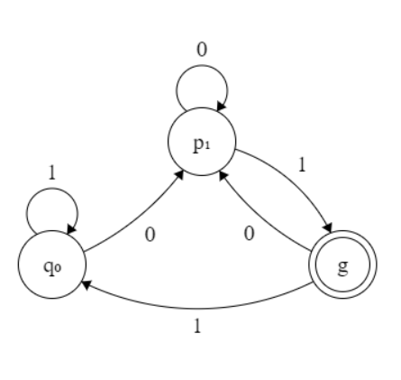

# Discussion 1: April 6, 2018
## Logistics
* Office Thurs 10am-12pm @ Boelter 2432
## Notation
* Σ represents an alphabet
* L = language
* M = DFA
* L(M) describes language accepted by machine
* L = {w| predicate over w} ∈ Σ*
## DFA
* Example for Σ = {0,1}; L = {w| all strings that end in 01} 

  
