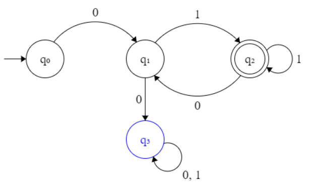

# Discussion 1: April 6, 2018
## Logistics
* Office Thurs 10am-12pm @ Boelter 2432
## Notation
* Σ represents an alphabet
* L = language
* M = DFA
* L(M) describes language accepted by machine
* L = {w| predicate over w} ∈ Σ*
* Σ* zero or more elements of the set
* Σ+ one or more elements of the set
## DFA
* Example for Σ = {0,1}; L = {w| all strings that end in 01} 

  
* Example for Σ = {0,1}; L = {w| no two consecutive 0s and ends with a 1}

  
## Transition Functions
* Denoted by δ(current state, input), returns next state
* [Example](https://qph.fs.quoracdn.net/main-qimg-20ed869770b369d15eb8365220016858)
  * δ(q2, 1) = q3
## Language Concatenation
* All accepting states of L1 transition to start state of L2, keep L2 accepting states
  1. Transition on t if you have an NFA
  2. If  must have a DFA, then: every transition from start in L2 is copied to every former accepting state in L1
