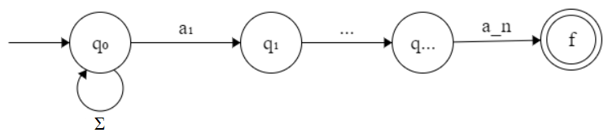

# Lecture 4: April 11, 2018
## Last Time
* Alphabet Σ = nonempty, finite set of symbols (except ε)
* Words = concatenation of symbols
* Language = set of words
* Family of languages = set of languages
* To get from alphabet to words, use concatenation operator •
* To get from words to lanuages, form sets {}
* How do we specify which languages are in a family of languages?
  * Set of all languages that can be recognized by a DFA = finite state languages (FSL)
## Regular Sets
* Basis: 
  * {}
  * {ε}
  * {ai} ∀ 1≤n≤i
* Inductive / Recursive: 
   * If r and s are regular sets, then so are
     * r • s
     * r ∪ s
     * r*
* Anything that's accepted by a DFA is a regular set; regular sets are equivalent to finite state languages
### Regular Expressions
* r • s becomes rs
* r ∪ s becomes r + s
* r* becomes r*
* Examples: 
  * a\*b\* denotes a run of 0 or more "a"s followed by a run of 0 or more "b"s
  * (a+b)* any string over the alphabet Σ = {a, b}; this is the same as Σ*
    * Note: Σ* denotes all strings over an alphabet
### Nondeterministic Finite Automata
* Given an alphabet Σ and a word w ∈ Σ*, we define a language that ends with w, End(w).
  * w = a1a2...an
  * End(w) = { xw | x ∈ Σ* }
  * M(w) = (Q, Σ, δ, q0, F)
  
    
### Non-Finite State Languages
* Example: 
  * Σ = { a, b , # }
  * L = { x#y | x,y ∈(a+b)* & |x|=|y| }
  * 
